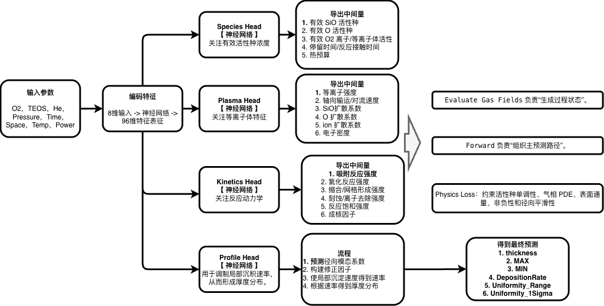
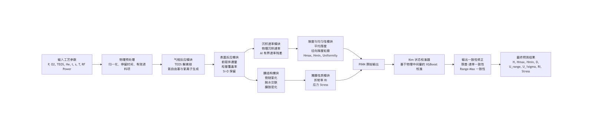
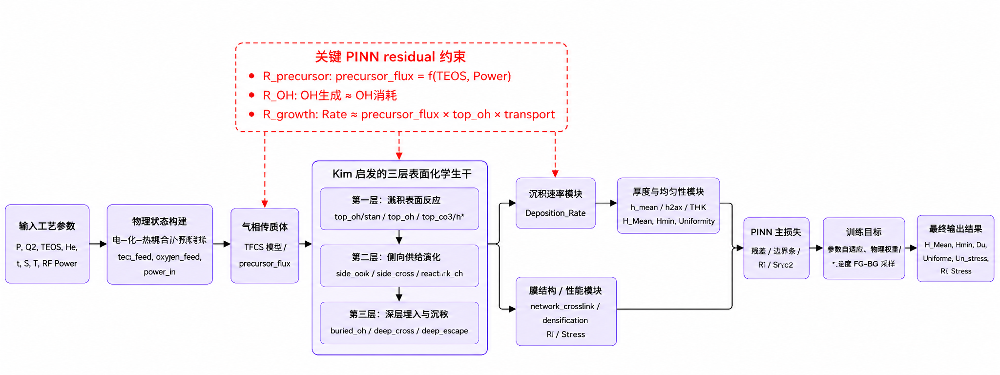

# 基于PINN的PECVD工艺研究

> ⚠️注意： 上传代码时，请在README中更新相应的内容。并且遵守如下的检查项目：
> - 将代码merge到本仓库中，运行一次得到output。
> - 在READMD中补充该项目，应该包括：介绍 + 流程图。注意，流程图务必体现原理。

### 方法一：XGBBaseline.py
- 介绍：基于XG Boost设计的多元预测问题，预测过程分为8次，即每个输出单独预测。
- 作者：ZC

### 方法二：PINN20260414.py
- 介绍：基于基本的PECVD原理设计的预测网络
- 作者：ZC

### 方法三：PINN20260511.py
- 介绍：基于物理约束建立的PECVD预测。
- 作者：ZC
- 流程图：

### 方法三：PINN20260512_HS.py
- 介绍: 基于KIM的方法对PECVD进行建模
- 作者：HS
- 流程图: 

- ### 方法四：PINN20260522_KimLayered.py
- 介绍: 基于 Kim 的 PECVD 沉积动力学思想，构建三层表面化学 PINN 模型，并通过关键 residual 约束前驱体通量、表面 OH 稳态和沉积速率，实现厚度、均匀性、RI 和 Stress 的物理一致性预测。
- 作者：ZC
- 流程图: 
